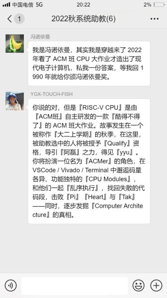
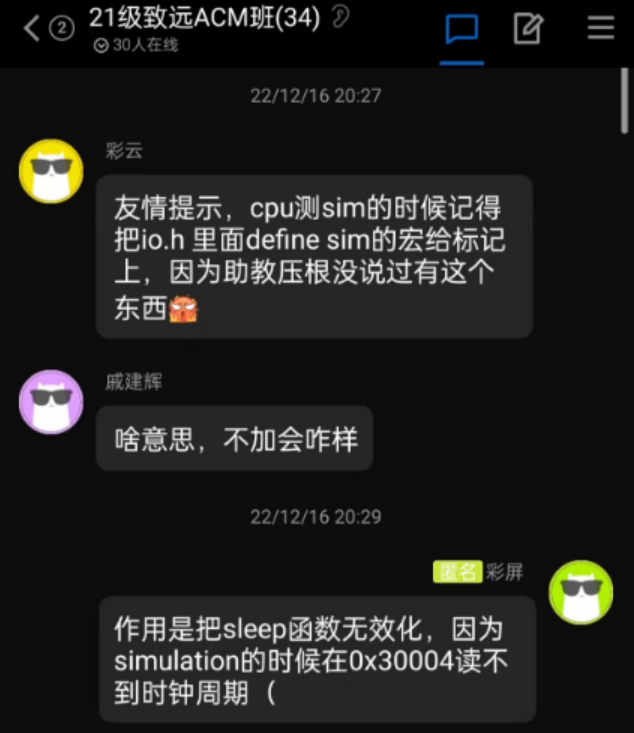

#  RISCV-CPU 2023

## 引言




## 项目说明

在本项目中，你需要使用 Verilog 语言完成一个简单的 RISC-V CPU 电路设计。Verilog 代码会以软件仿真和 FPGA 板两种方式运行。你设计的电路将运行若干测试程序并可能有输入数据，执行得到的输出数据将与期望结果比较，从而判定你的 Verilog 代码的正确性。**你需要实现 CPU 的运算器与控制器，而内存等部件题面已提供代码**。要求最终你的CPU需要能够正确**完成RISC-V指令集中的部分指令，支持tomasulo算法的乱序执行，并且能够在FPGA上运行所有测试点**。具体项目要求和项目阶段划分见下文。


### 项目阶段

- 环境配置
- 完成 `cpu.v` 的所有模块, 根据 `riscv/src/cpu.v` 提供的接口自顶向下完成代码，其余题面代码尽量不要改动
- 使用 iVerilog 进行本地仿真测试（结果为 `.vcd` 文件）通过可执行的测试
- 将 Verilog 代码烧录至 FPGA 板上，在 FPGA 上通过所有测试


### 时间安排

> 时间以上海交通大学 2023-2024 学年校历为准，Week 4 周一为 2023.10.02

每 2 周一次检查，检查时间为每周日 22:00 后，下表为检查形式与标准：
鉴于去年的情况，助教选择中间预留更长时间并且多多push，以保证大家的代码能够在期末前的时间里有一个不错的进度。
另外，由于主体部分工作很多，助教大概率会在期中安排code review保证进度，具体时间会考虑同学们期中的work load。

| 时间        | 检查内容                                                        |
| ----------- | --------------------------------------------------------------- |
| **Week 4**  | 仓库创建                                                        |
| **Week 6**  | 完成电路设计草稿 / 各个 CPU 模块文件创建                        |
| **Week 8**  | 开始完善部分模块代码，checkpoint 1                              |
| **Week 10** | 完善部分模块代码，尝试连线，checkpoint 2                        |
| **Week 12** | 各个 CPU 模块文件基本完成，完成 `cpu.v` 连线，checkpoint 3      |
| **Week 14** | Simulation 初步debug 通过 `gcd`                                 |
| **Week 16** | Simulation 完成debug 通过除 `tak`，`heart`，`pi` 之外的所有样例 |
| **Week 18** | FPGA 通过所有样例                                               |

### 分数构成

本作业满分为 100%。

| 评分项目        | 分数   | 说明                                     |
| --------------- | ------ | ---------------------------------------- |
| **仿真测试**    | 75%    | 在 OJ 通过所有仿真测试点                 |
| **FPGA 测试**   | 10%    | 在 OJ 通过所有 FPGA 测试点               |
| **Code Review** | 5%+10% | 以面谈形式考察 CPU 原理与 HDL 的理解掌握 |

Code Review 将会有两次，分别在期中和期末，分别占 5%、10%。期中的 Code Review 会考察 CPU 原理的设计和工程进度，期末的 Code Review 会考察整个项目的理解掌握。Code Review 会以面谈形式进行，面谈时间、地点将会在课程群内通知。 


### 仓库文件结构

```C++
📦RISCV-CPU
 ┣ 📂riscv		// 项目根目录
 ┃ ┣ 📂fpga			// FPGA 开发板相关
 ┃ ┣ 📂script		// 编译测试相关参考脚本
 ┃ ┣ 📂sim			// 仿真运行 Testbench
 ┃ ┣ 📂src			// HDL 源代码
 ┃ ┃ ┣ 📂common			// 题面提供部件源代码
 ┃ ┃ ┣ 📜cpu.v			// CPU 核心代码
 ┃ ┣ 📂sys			// 编译 C 语言测试点所需文件
 ┃ ┣ 📂testcase		// 测试点
 ┃ ┃ ┣ 📂fpga			// 全部测试点 (全集)
 ┃ ┃ ┗ 📂sim			// 仿真运行测试点 (子集)
 ┃ ┣ 📂testspace	// 编译运行结果
 ┃ ┗ 📜Makefile		// 编译及测试脚本
 ┣ 📂serial		// 用于访问 FPGA 串口的第三方库
 ┣ 📂doc		// **题面补充文档，包括环境配置、频率修改、vivado配置教程和文件**
 ┗ 📜README.md	// 题面文档
```

### 指令集

> 可参考资料见 [RISC-V 指令集](#RISC-V-指令集)

本项目使用 **RV32I 指令集**

基础测试内容不包括 Doubleword 和 Word 相关指令、Environment 相关指令和 CSR 相关等指令。

必须要实现的指令为以下 37 个：`LUI`, `AUIPC`, `JAL`, `JALR`, `BEQ`, `BNE`, `BLT`, `BGE`, `BLTU`, `BGEU`, `LB`, `LH`, `LW`, `LBU`, `LHU`, `SB`, `SH`, `SW`, `ADDI`, `SLLI`, `SLTI`, `SLTIU`, `XORI`, `SRLI`, `SRAI`, `ORI`, `ANDI`, `ADD`, `SUB`, `SLL`, `SLT`, `SLTU`, `XOR`, `SRL`, `SRA`, `OR`, `AND`


如果需要额外参考信息，以下内容可能对你有帮助：
- RISC-V官网 https://riscv.org/
- [官方文档下载页面](https://riscv.org/technical/specifications/)
- 基础内容见 Volume 1, Unprivileged Spec
- 特权指令集见 Volume 2, Privileged Spec
- 非官方 [Read the Docs 文档](https://msyksphinz-self.github.io/riscv-isadoc/html/index.html)
- 非官方 Green Card，[PDF 下载链接](https://inst.eecs.berkeley.edu/~cs61c/fa17/img/riscvcard.pdf)

### Simulation测试

-  在本地 Simulation 时，部分样例运行时间可能会非常非常长，如 `heart.c` 与 `pi.c`。这些样例不会被算入 Simulation 的测试范围，但会在 FPGA 检查阶段纳入测试范围。
- 为了让一些不用 `sleep` 函数的本地 simulation 跑得更快，本地测评版本中的 `riscv/sys/io.h` 并没有 `#define SIM`，导致一些需要 `sleep` 函数的测试点无法本地正确测试，比如 `qsort` 测试点会因为`sleep`没执行导致时钟始终为$0$而执行异常，如果需要本地测评这类测试点记得在 `riscv/sys/io.h` 中加上`#define SIM`。


### Vivado配置和FPGA

- **Vivado**

  - 你需要该软件将 Verilog 代码编译为可以烧录至 FPGA 板的二进制文件

  - Vivado 安装后软件整体大小达 30G 左右，请准备足够硬盘空间

- **Serial Communication Library**

  - 程序与 FPGA 板通过 USB 通讯过程中使用该库
  - 安装方式参见本仓库 `doc` 分支，2023-10-03 update：范老师关于WSL2上板指引 `RISC-V-CPU-2023/doc/RISCV-CPU-doc/doc/qweryy-Vivado-wsl2.md`

- Vivado 不支持 MacOS 系统，故如果使用 Mac 则必须使用虚拟机，推荐 Ubuntu Desktop。此外对于使用 Windows 电脑的同学，RISC-V Toolchain 也推荐在 Linux 系统上安装。
- FPGA 开发板比较脆弱，使用时请注意爱护，除垫脚外不要有磕碰或硬物接触；不要让导电物品（注意人体是导电的）接触到板上按钮除外的金属部分。


### Q & A （**这可能对你来说非常重要。**）

1. **我的 CPU 会从哪里读取指令并执行？**

   从 `0x0000000` 地址处开始执行。

2. **我的 CPU 如何停机？**

   见 `cpu.v` 中 `Specification` 部分。

3. **我的寄存器堆（Register File）需要多少个寄存器？**

   Unprivileged CPU: 32；

   Privileged CPU: 32 + 8 (CSR)。

4. **托马斯洛算法并没有硬件实现的公认唯一标准，那么本项目有什么特殊要求吗？**

   托马斯洛的要求可参考 [Wikipedia](https://en.wikipedia.org/wiki/Tomasulo%27s_algorithm#Instruction_lifecycle)，即执行一条指令需要涉及 *Issue*、*Execute*、*Write Result* 三步骤。此外，**必须要实现 *Instruction Cache*** 以确保程序运行过程中会出现多条指令的 lifecycle 重叠的情况。

5. **我该如何开始运行代码？**

   在 `riscv/` 路径下运行 `make test_sim name=000` 指令即可自动编译并运行第一个仿真测试点，测试文件均在 `riscv/testspace/` 文件夹中。

6. **`io_buffer_full`?**

   用于指示当前 ram 的 io buffer 是否已满。若已满，可能会出现 overwrite / loss。在FPGA debug阶段注意正确响应此信号。

   注意：此信号在 simulation 部分始终为 low (false)，但在 FPGA 上会有高低变化。所以在 simulation 中，你可以忽略此信号。

7. **`in_rdy`?**

   用于指示当前hci总线是否为active (可工作)，若否，则cpu应当pause。

8. **运行测试过程中 build 报错？**

   请考虑以下几点：

   - 目录错误

     脚本运行目录应当为 `riscv/` 文件夹

   - 环境缺失，如 `cannot find module -lgcc ...`

     **在配置了riscv-toolchains 的环境下，应当可以正常 build。**

     **请检查连接了 FPGA 的系统是否配置了 riscv-toolchains，若没有，你也可以使用现成的编译结果。**

9. **vivado如何debug？**
   在vivado上入手过程是首先跑一遍synthesis和implementation，然后确保消除所有latch和multi-driven两种会影响程序正确性的warning，它们一般来自于simulation过程中没有考虑到的物理电路的特性。一般bug在保证了simulation的正确性，再加上适应电路的特性之后能得到解决。

10. to be continued...
